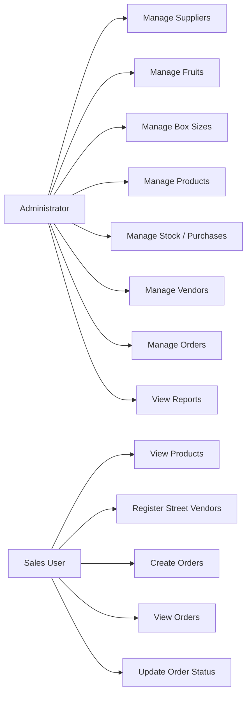

# Batloung Farm Use-Case Diagram

```mermaid
flowchart LR
    A[Administrator] --> S1[Manage Suppliers]
    A --> S2[Manage Fruits]
    A --> S3[Manage Box Sizes]
    A --> S4[Manage Products]
    A --> S5[Manage Stock / Purchases]
    A --> S6[Manage Vendors]
    A --> S7[Manage Orders]
    A --> S8[View Reports]

    B[Sales User] --> V1[View Products]
    B --> V2[Register Street Vendors]
    B --> V3[Create Orders]
    B --> V4[View Orders]
    B --> V5[Update Order Status]
```
